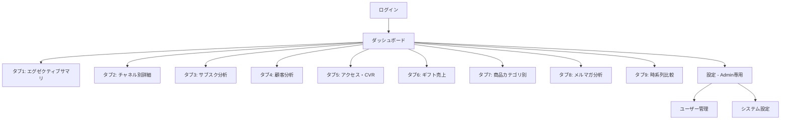

# プロトタイプ仕様書

## プロトタイプの目的とスコープ

### 目的
- PMからのUI/UXフィードバック取得（タブ構成・レイアウト・グラフ種別の妥当性）
- 9タブのダッシュボードレイアウトが業務フローに合っているかの検証
- ECharts（イベントフラグ付き時系列・コホートヒートマップ）の技術的フィージビリティ確認

### スコープ
| 含む | 含まない |
|------|---------|
| 9タブのダッシュボードレイアウト | Google SSO認証（モック認証で代替） |
| KPIカード表示（モックデータ） | BigQueryリアルタイム連携 |
| 共通フィルタバーUI（期間/チャネル/比較モード） | データエクスポート（CSV） |
| 各タブのグラフ種別確認（ECharts） | Slack通知 |
| イベントフラグ付き時系列グラフ | ユーザー管理画面 |
| コホートヒートマップ | システム設定画面 |
| ギフトシーズン進捗ゲージ | ETL/データパイプライン |
| サイドバー + タブナビゲーション | レスポンシブ（タブレット） |

## ワイヤーフレーム概要

画面別ワイヤーフレーム画像は以下に格納:
- `docs/02_design/ui/wireframes/01_login.png`
- `docs/02_design/ui/wireframes/02_dashboard-executive.png`
- `docs/02_design/ui/wireframes/03_dashboard-channel.png`
- `docs/02_design/ui/wireframes/04_dashboard-subscription.png`
- `docs/02_design/ui/wireframes/05_dashboard-customer.png`
- `docs/02_design/ui/wireframes/06_dashboard-access.png`
- `docs/02_design/ui/wireframes/07_dashboard-gift.png`
- `docs/02_design/ui/wireframes/08_dashboard-product.png`
- `docs/02_design/ui/wireframes/09_dashboard-email.png`
- `docs/02_design/ui/wireframes/10_dashboard-timeseries.png`
- `docs/02_design/ui/wireframes/11_settings.png`

## 画面遷移の大枠

## デザイン方針の初期決定事項

| 項目 | 決定内容 |
|------|---------|
| カラースキーム | ライト基調 |
| フォント | Inter + Noto Sans JP |
| UIライブラリ | shadcn/ui + Tailwind CSS |
| アイコン | Lucide React |
| グラフライブラリ | Apache ECharts（ヒートマップ・markLine/markArea・dataZoom対応） |
| テーブル | TanStack Table v8（ソート・フィルタ・ページネーション） |
| レイアウト | サイドバー（タブナビゲーション）+ メインコンテンツ |

詳細デザイン仕様は `docs/02_design/ui/design-system.md` に定義。

## プロトタイプで検証するポイント

| # | 検証項目 | 判断基準 |
|---|---------|---------|
| 1 | 9タブ構成で業務フローをカバーできるか | PMレビューで過不足なし |
| 2 | イベントフラグ付き時系列の視認性 | 販促イベント期間が一目でわかる |
| 3 | コホートヒートマップの操作性 | フィルタ切替でスムーズに表示更新 |
| 4 | ギフトシーズン進捗ゲージのわかりやすさ | 前年ペースとの比較が直感的 |
| 5 | 同曜日比較トグルの使い勝手 | 暦日/同曜日の切替が迷わない |
| 6 | 共通フィルタバーの操作フロー | チャネル・期間の絞り込みがスムーズ |

## フィードバック記録

| 日付 | レビュアー | フィードバック内容 | 対応 |
|------|----------|-----------------|------|
| - | - | - | - |
