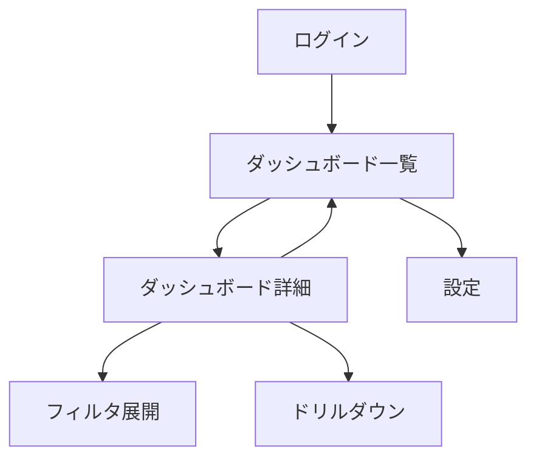

# プロトタイプ仕様書

## プロトタイプの目的とスコープ

### 目的
- [TODO: ステークホルダーからのUI/UXフィードバック取得]
- [TODO: ダッシュボードレイアウトの妥当性検証]
- [TODO: 技術的フィージビリティの確認]

### スコープ
| 含む | 含まない |
|------|---------|
| ダッシュボードメイン画面のレイアウト | 認証機能 |
| KPIカードの表示 | リアルタイムデータ連携 |
| 基本的なフィルタUI | データエクスポート |
| グラフの種別確認 | マルチテナント |
| [TODO] | [TODO] |

## ワイヤーフレーム概要

画面別ワイヤーフレーム画像は以下に格納:
- `docs/02_design/ui/wireframes/01_login.png`
- `docs/02_design/ui/wireframes/02_dashboard-list.png`
- `docs/02_design/ui/wireframes/03_dashboard-detail.png`
- `docs/02_design/ui/wireframes/04_settings.png`

> **Note:** Figma AIで作成。解像度2x、状態別（通常/ローディング/データ0件/エラー）に分けて保存。

## 画面遷移の大枠

## デザイン方針の初期決定事項

| 項目 | 決定内容 |
|------|---------|
| カラースキーム | [TODO: ライト基調 / ダーク基調 / 切替対応] |
| フォント | [TODO: Inter + Noto Sans JP] |
| UIライブラリ | shadcn/ui + Tailwind CSS |
| アイコン | Lucide React |
| グラフライブラリ | Recharts |
| レイアウト | サイドバー + メインコンテンツ |

詳細デザイン仕様は `docs/02_design/ui/design-system.md` に定義。

## フィードバック記録

| 日付 | レビュアー | フィードバック内容 | 対応 |
|------|----------|-----------------|------|
| [TODO] | [TODO] | [TODO] | [TODO: 対応済/検討中/見送り] |
