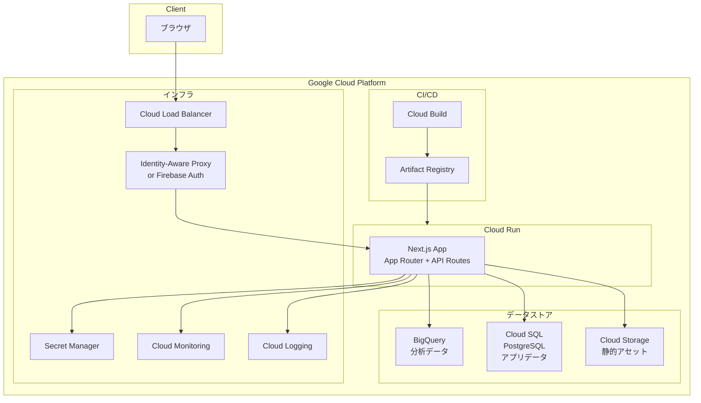

# システムアーキテクチャ設計書

## アーキテクチャ図

## 技術スタック一覧

| レイヤー | 技術 | バージョン |
|---------|------|-----------|
| フロントエンド | Next.js (App Router) | 15.x |
| 言語 | TypeScript | 5.x |
| UIライブラリ | shadcn/ui + Tailwind CSS | 最新 |
| チャート | Recharts | 2.x |
| 状態管理 | Zustand | 5.x |
| バリデーション | Zod | 3.x |
| データ取得 | TanStack Query | 5.x |
| 認証 | NextAuth.js | 5.x |
| ORM | Prisma | 6.x |
| 分析DB | BigQuery | - |
| アプリDB | Cloud SQL (PostgreSQL) | 16 |
| ランタイム | Cloud Run | gen2 |
| IaC | Terraform | 1.9+ |
| CI/CD | Cloud Build | - |
| 監視 | Cloud Monitoring + Logging | - |

## GCPサービス構成

| サービス | 用途 | 備考 |
|---------|------|------|
| Cloud Run | アプリケーション本体 | Container-based, オートスケーリング |
| BigQuery | 分析データストア | 読み取り専用、パラメタライズドクエリ |
| Cloud SQL | 認証・セッション・メタデータ | PostgreSQL 16 |
| Cloud Storage | 静的アセット・エクスポート | CDN配信 |
| Cloud Build | CI/CDパイプライン | cloudbuild.yaml |
| Artifact Registry | コンテナイメージ | Docker |
| Cloud Monitoring | メトリクス・アラート | SLO監視 |
| Cloud Logging | ログ集約 | 構造化JSON |
| Secret Manager | シークレット管理 | APIキー、DB接続情報等 |
| [TODO: Firebase Auth / IAP] | 認証 | Google OAuth 2.0 |

## コンテナ構成

- マルチステージビルド（deps → build → runner）
- Node.js 22 Alpine ベース
- Next.js standalone output
- Non-rootユーザーで実行
- ヘルスチェックエンドポイント: `/api/health`

## 環境分離

| 環境 | ブランチ | Cloud Run | BigQuery | Cloud SQL |
|------|---------|-----------|----------|-----------|
| dev | feature/* | ローカル (docker compose) | [TODO: dev dataset] | ローカルPostgreSQL |
| stg | staging | dsbd-stg | [TODO: stg dataset] | dsbd-stg-db |
| prod | main | dsbd-prod | [TODO: prod dataset] | dsbd-prod-db |

## ADR（アーキテクチャ決定記録）テンプレート

### ADR-001: [TODO: タイトル]

| 項目 | 内容 |
|------|------|
| 日付 | [TODO: YYYY-MM-DD] |
| ステータス | [TODO: 提案/承認/廃止] |
| コンテキスト | [TODO: 背景と制約] |
| 決定 | [TODO: 決定内容] |
| 代替案 | [TODO: 検討した代替案] |
| 結果 | [TODO: 影響と結果] |
