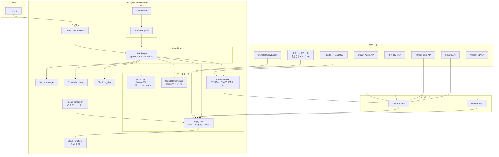

# システムアーキテクチャ設計書

## アーキテクチャ図



## 技術スタック一覧

| レイヤー | 技術 | バージョン | 選定理由 |
|---------|------|-----------|---------|
| フロントエンド | Next.js (App Router) | 15.x | SSR/ISRで高速表示 |
| 言語 | TypeScript | 5.x | 型安全 |
| UIライブラリ | shadcn/ui + Tailwind CSS | 最新 | 高品質コンポーネント |
| チャート | Apache ECharts | 5.x | ヒートマップ・markLine/markArea・dataZoom対応 |
| テーブル | TanStack Table | v8 | ソート・フィルタ・ページネーション |
| 状態管理 | Zustand | 5.x | 軽量 |
| バリデーション | Zod | 3.x | スキーマバリデーション |
| データ取得 | TanStack Query | 5.x | キャッシュ・再フェッチ管理 |
| 認証 | NextAuth.js | 5.x | Google OAuth 2.0 |
| ORM | Prisma | 6.x | Cloud SQL接続 |
| 分析DB | BigQuery | - | 3層構成（Raw/Staging/Mart） |
| アプリDB | Cloud SQL (PostgreSQL) | 16 | ユーザー・セッション・メタデータ |
| キャッシュ | Cloud Memorystore (Redis) | - | Martクエリ結果のキャッシュ |
| ランタイム | Cloud Run | gen2 | オートスケーリング |
| IaC | Terraform | 1.9+ | インフラコード管理 |
| CI/CD | Cloud Build | - | GitHub連携自動デプロイ |
| 監視 | Cloud Monitoring + Logging | - | メトリクス・構造化ログ |

## GCPサービス構成

| サービス | 用途 | 備考 |
|---------|------|------|
| Cloud Run | アプリケーション本体 | min: 1, max: 5。オートスケーリング |
| BigQuery | 分析データストア | 読み取り専用。Raw/Staging/Mart 3層。~5-8GB |
| Cloud SQL | ユーザー・セッション・メタデータ | PostgreSQL 16 |
| Cloud Memorystore | Martクエリ結果のキャッシュ | Redis。TTL: Mart更新サイクルに合わせて日次 |
| Cloud Storage | CSV取込（R-Karte等）・CSVエクスポート出力 | 署名付きURLでダウンロード |
| Cloud Build | CI/CDパイプライン | cloudbuild.yaml |
| Artifact Registry | コンテナイメージ | Docker |
| Cloud Scheduler | BigQueryスケジュールクエリのトリガー | Raw→Staging→Mart日次変換 |
| Cloud Functions | Slack通知（日次サマリ・閾値アラート・ETLエラー） | |
| Cloud Monitoring | メトリクス・アラート | SLO監視 |
| Cloud Logging | ログ集約 | 構造化JSON |
| Secret Manager | シークレット管理 | OAuth credentials、DB接続情報 |

## データフロー

```
[ETL日次更新]
AM 03:00  Trocco → BigQuery (Raw)    : Shopify/楽天/Yahoo!/Klaviyo
AM 04:30  Fivetran → BigQuery (Raw)   : Amazon
AM 05:00  GA4 BQ Export → BigQuery    : アクセスログ
AM 07:00  BQ Scheduled Query          : Raw → Staging変換
AM 07:30  BQ Scheduled Query          : Staging → Mart集計
AM 08:00  キャッシュ更新 + Slack通知   : ダッシュボード反映完了

[手動取込]
R-Karte / R-Mail CSV → GCS → Trocco CSV → BigQuery (Raw)
売上目標 / イベント → ダッシュボード管理画面 → Cloud SQL → BigQuery
```

## コンテナ構成

- マルチステージビルド（deps → build → runner）
- Node.js 22 Alpine ベース
- Next.js standalone output
- Non-rootユーザーで実行
- ヘルスチェックエンドポイント: `/api/health`

## 環境分離

| 環境 | ブランチ | Cloud Run | BigQuery Dataset | Cloud SQL |
|------|---------|-----------|------------------|-----------|
| dev | feature/* | ローカル (docker compose) | ec_dashboard_dev | ローカルPostgreSQL |
| stg | staging | ec-dashboard-stg | ec_dashboard_stg | ec-dashboard-stg-db |
| prod | main | ec-dashboard-prod | ec_dashboard_prod | ec-dashboard-prod-db |

## ADR（アーキテクチャ決定記録）

### ADR-001: チャートライブラリの選定

| 項目 | 内容 |
|------|------|
| 日付 | 2026-02-24 |
| ステータス | 承認 |
| コンテキスト | ダッシュボードにはヒートマップ（コホート分析）、イベントフラグ付き時系列（markLine/markArea）、dataZoom（期間スクロール）が必要 |
| 決定 | Apache ECharts を採用（テンプレートデフォルトのRechartsから変更） |
| 代替案 | Recharts（markLine/markArea未対応）、D3.js（低レベルすぎる）、Chart.js（ヒートマップ弱い） |
| 結果 | 提案書§6記載の全グラフ要件をカバー可能。バンドルサイズ増（~400KB gzip）はtree-shakingで軽減 |

### ADR-002: ETLツールの選定

| 項目 | 内容 |
|------|------|
| 日付 | 2026-02-24 |
| ステータス | 承認 |
| コンテキスト | 4チャネル（Shopify/楽天/Amazon/Yahoo!）+ メルマガ + CSV取込のETLが必要 |
| 決定 | Trocco Starter（Shopify/楽天/Yahoo!/Klaviyo/CSV）+ Fivetran Free（Amazon） |
| 代替案 | Fivetranのみ（楽天/Yahoo!ネイティブコネクタ未提供）、自前ETL（開発・保守コスト大） |
| 結果 | 月額¥75,000。楽天/Yahoo!はTrocco HTTPコネクタで対応。Amazonは Fivetran Freeの500K MAR枠内 |

### ADR-003: キャッシュ戦略

| 項目 | 内容 |
|------|------|
| 日付 | 2026-02-24 |
| ステータス | 承認 |
| コンテキスト | BigQuery Martへの直接クエリはレイテンシ1-3秒。ダッシュボードのAPI応答300ms目標を達成するためキャッシュが必要 |
| 決定 | Cloud Memorystore (Redis) でMartクエリ結果をキャッシュ。日次バッチ完了時にキャッシュ更新 |
| 代替案 | Next.js ISR（柔軟性不足）、キャッシュなし（レイテンシ目標未達） |
| 結果 | 月額~¥5,000。日次更新データのため、キャッシュTTL=24時間で鮮度と速度を両立 |
