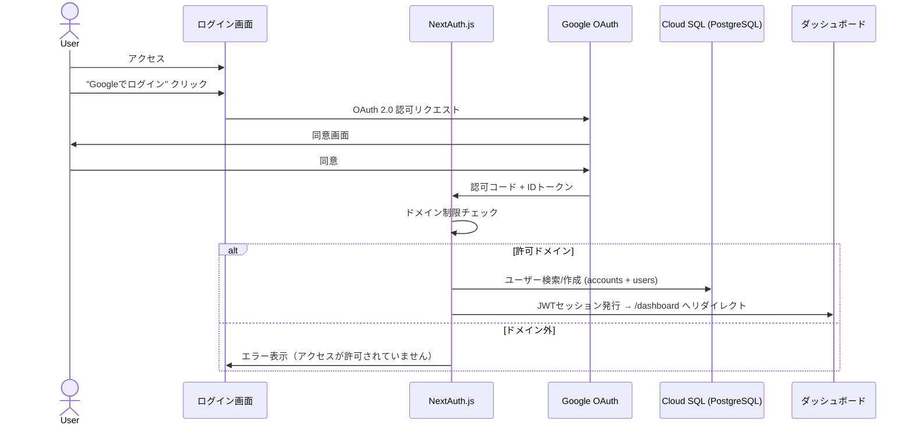

# 認証・認可設計書

## 認証方式

本システムはGoogle SSO (OAuth 2.0) のみで認証する。NextAuth.js v5で管理。

| # | 認証方式 | ユースケース |
|---|---------|------------|
| 1 | Google SSO (OAuth 2.0) | 全ユーザー（Google Workspaceドメイン制限） |



---

## Google SSO (OAuth 2.0) 設定

| 項目 | 値 |
|------|------|
| Provider | Google OAuth 2.0 |
| Scopes | `openid`, `email`, `profile` |
| 許可ドメイン | 環境変数 `ALLOWED_EMAIL_DOMAINS` で設定 |
| Consent Screen | Internal（Google Workspace） |
| Callback URL | `{APP_URL}/api/auth/callback/google` |

### Google Cloud Console 設定手順

1. **OAuth同意画面** を設定（Internal推奨）
2. **認証情報** → OAuth 2.0 クライアントIDを作成
   - アプリケーション種類: ウェブアプリケーション
   - 承認済みリダイレクトURI: `https://{DOMAIN}/api/auth/callback/google`
3. クライアントID / クライアントシークレットを Secret Manager に格納

### ドメイン制限

```typescript
async signIn({ account, profile }) {
  if (account?.provider === 'google') {
    const allowedDomains = process.env.ALLOWED_EMAIL_DOMAINS?.split(',') ?? []
    const emailDomain = profile?.email?.split('@')[1]
    if (allowedDomains.length > 0 && !allowedDomains.includes(emailDomain ?? '')) {
      return false
    }
  }
  return true
}
```

### 初回ログイン時の自動ユーザー作成

Google SSOで初回ログインしたユーザーは自動的に `VIEWER` ロールで作成。
Adminが後からユーザー管理画面でロール変更する運用フロー。

---

## セッション管理

| 項目 | 設定 |
|------|------|
| 方式 | JWT (NextAuth.js) |
| 保存先 | HttpOnly Cookie |
| アクセストークン有効期限 | 24時間 |
| リフレッシュトークン有効期限 | 7日間 |
| SameSite | Strict |
| Secure | true (HTTPS必須) |
| Cookie名 | `__Secure-next-auth.session-token` |

### JWTペイロードの拡張

```typescript
callbacks: {
  async jwt({ token, user }) {
    if (user) {
      token.role = user.role
      token.id = user.id
    }
    return token
  },
  async session({ session, token }) {
    if (session.user) {
      session.user.role = token.role as UserRole
      session.user.id = token.id as string
    }
    return session
  },
}
```

## トークンリフレッシュ戦略

```
1. ユーザーがAPIリクエスト
2. アクセストークンの有効期限を確認
3. 期限切れの場合:
   a. リフレッシュトークンでアクセストークンを再取得
   b. リフレッシュトークンも期限切れ → ログイン画面にリダイレクト
4. 有効な場合: APIリクエストを実行
```

---

## ユーザーロール定義

| ロール | 説明 | 権限レベル |
|--------|------|-----------|
| ADMIN | 管理者 | 全機能 + ユーザー管理 + システム設定 |
| VIEWER | 閲覧者 | ダッシュボード閲覧 + フィルタ操作 + データエクスポート |

## 権限マトリクス

| 機能 | Admin | Viewer | APIエンドポイント |
|------|-------|--------|-----------------|
| ダッシュボード閲覧（全9タブ） | o | o | GET /api/dashboard/* |
| フィルタ操作 | o | o | - (クライアント側) |
| データエクスポート（CSV） | o | o | GET /api/export/* |
| ユーザー一覧 | o | x | GET /api/admin/users |
| ユーザー招待 | o | x | POST /api/admin/users/invite |
| ユーザー権限変更 | o | x | PUT /api/admin/users/:id/role |
| ユーザー削除 | o | x | DELETE /api/admin/users/:id |
| システム設定 | o | x | GET/PUT /api/admin/settings |
| イベントカレンダー管理 | o | x | GET/POST/PUT/DELETE /api/admin/events |
| 売上目標管理 | o | x | GET/POST/PUT /api/admin/targets |
| ギフトシーズン定義編集 | o | x | GET/PUT /api/admin/gift-seasons |

---

## セキュリティ対策

| 対策 | 実装 |
|------|------|
| CSRF防御 | NextAuth.jsのCSRFトークン |
| XSS防御 | HttpOnly Cookie + CSPヘッダ |
| セッション固定攻撃 | ログイン時にセッションID再生成 |
| 権限昇格防御 | サーバーサイドでロールチェック (middleware + API) |
| トークン窃取対策 | Secure + HttpOnly + SameSite=Strict |

---

## ログイン画面UI仕様

### レイアウト

```
┌──────────────────────────────────────┐
│        [ロゴ]                         │
│   Soup Stock Tokyo EC Dashboard      │
│                                      │
│  ┌──────────────────────────────┐    │
│  │  [G] Googleでログイン         │    │
│  └──────────────────────────────┘    │
│                                      │
└──────────────────────────────────────┘
```

### 状態遷移

| 状態 | 表示 |
|------|------|
| 初期表示 | Google SSOボタン |
| ローディング | ボタン内スピナー + disabled |
| Google SSO失敗 | フォーム上部に赤色エラーバナー「Google認証に失敗しました。再度お試しください。」 |
| ドメイン外 | 「アクセスが許可されていません。管理者にお問い合わせください。」 |

---

## Claude Code実装ガイド

### ファイル構成

```
src/
├── app/
│   ├── login/page.tsx                    # ログイン画面
│   └── api/auth/[...nextauth]/route.ts   # NextAuth APIルート
├── lib/
│   ├── auth.ts                           # NextAuth設定（Google Provider）
│   └── prisma.ts                         # Prismaクライアント
├── middleware.ts                          # 認証ミドルウェア（未認証→/login、Admin専用パス制御）
└── types/
    └── next-auth.d.ts                    # NextAuth型拡張（role追加）
```

### 実装順序

1. `prisma/schema.prisma` にUser/Account/Sessionモデル定義 → `npx prisma migrate dev`
2. `src/lib/auth.ts` NextAuth設定（Google Provider + ドメイン制限 + JWT拡張）
3. `src/app/login/page.tsx` ログインUI（Google SSOボタンのみ）
4. `src/middleware.ts` 認証ミドルウェア（未認証リダイレクト + Admin専用パス `/settings/*` のロールチェック）
5. `src/types/next-auth.d.ts` NextAuth型拡張
6. テスト作成（`tests/unit/auth.test.ts`, `tests/integration/login.test.ts`）
