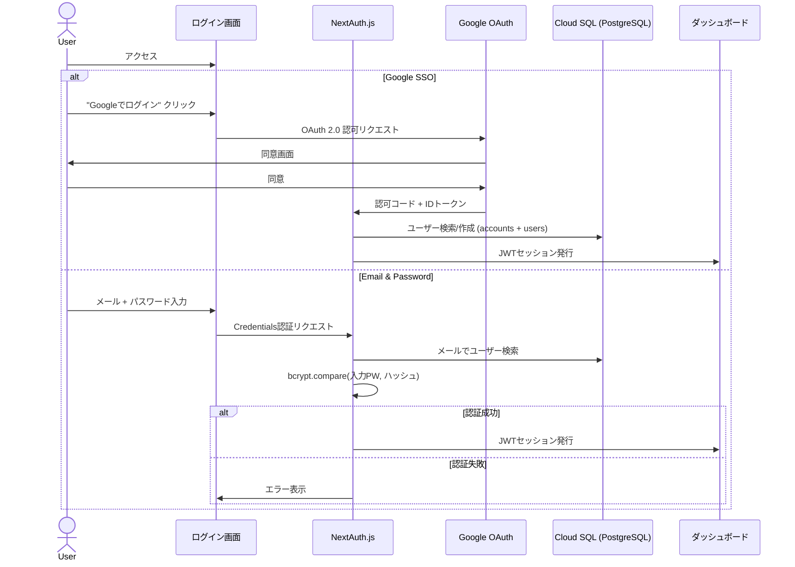
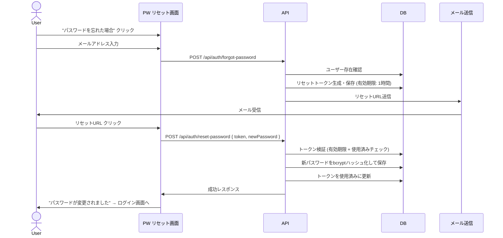

# 認証・認可設計書

## 認証方式一覧

本システムは2つの認証方式を提供し、NextAuth.js v5で統合管理する。

| # | 認証方式 | ユースケース | 優先度 |
|---|---------|------------|--------|
| 1 | Google SSO (OAuth 2.0) | 社内ユーザー（Google Workspaceアカウント保持者） | 必須 |
| 2 | Email & Password | 外部パートナー・Google未使用ユーザー | 必須 |



---

## 方式1: Google SSO (OAuth 2.0)

### 設定

| 項目 | 値 |
|------|------|
| Provider | Google OAuth 2.0 |
| Scopes | `openid`, `email`, `profile` |
| 許可ドメイン | [TODO: 会社ドメイン (例: @example.com)] |
| Consent Screen | Internal（Google Workspace）/ External |
| Callback URL | `{APP_URL}/api/auth/callback/google` |

### Google Cloud Console 設定手順

1. **OAuth同意画面** を設定（Internal推奨）
2. **認証情報** → OAuth 2.0 クライアントIDを作成
   - アプリケーション種類: ウェブアプリケーション
   - 承認済みリダイレクトURI: `https://{DOMAIN}/api/auth/callback/google`
3. クライアントID / クライアントシークレットを Secret Manager に格納

### ドメイン制限（Google Workspace向け）

```typescript
// Google OAuthのcallbackでドメイン制限を実施
async signIn({ account, profile }) {
  if (account?.provider === 'google') {
    const allowedDomains = process.env.ALLOWED_EMAIL_DOMAINS?.split(',') ?? []
    const emailDomain = profile?.email?.split('@')[1]
    if (allowedDomains.length > 0 && !allowedDomains.includes(emailDomain ?? '')) {
      return false // 許可ドメイン外は拒否
    }
  }
  return true
}
```

### 初回ログイン時の自動ユーザー作成

Google SSOで初回ログインしたユーザーは自動的に `VIEWER` ロールで作成。
Admin が後から権限管理画面で変更する運用フロー。

---

## 方式2: Email & Password 認証

### パスワード要件

| 項目 | 要件 |
|------|------|
| 最小文字数 | 12文字以上 |
| 必須文字種 | 英大文字 + 英小文字 + 数字 + 記号のうち3種以上 |
| 禁止パターン | ユーザー名・メールアドレスを含むPW、連続同一文字3回以上 |
| 有効期限 | 90日（変更推奨通知） |
| 履歴 | 直近5世代と同一PWは使用不可 |

### パスワード暗号化

| 項目 | 設定 |
|------|------|
| ハッシュアルゴリズム | **bcrypt** |
| ソルトラウンド | 12 |
| ライブラリ | `bcryptjs` (pure JS, Cloud Run互換) |
| 保存先 | Cloud SQL `users.password_hash` カラム |

```typescript
import bcrypt from 'bcryptjs'

const SALT_ROUNDS = 12

/** パスワードをハッシュ化して保存 */
export async function hashPassword(plainPassword: string): Promise<string> {
  return bcrypt.hash(plainPassword, SALT_ROUNDS)
}

/** パスワード検証 */
export async function verifyPassword(
  plainPassword: string,
  hashedPassword: string,
): Promise<boolean> {
  return bcrypt.compare(plainPassword, hashedPassword)
}
```

### パスワードバリデーション (Zod)

```typescript
import { z } from 'zod'

export const passwordSchema = z
  .string()
  .min(12, 'パスワードは12文字以上で入力してください')
  .regex(/[A-Z]/, '英大文字を1文字以上含めてください')
  .regex(/[a-z]/, '英小文字を1文字以上含めてください')
  .regex(/[0-9]/, '数字を1文字以上含めてください')
  .regex(/[^A-Za-z0-9]/, '記号を1文字以上含めてください')
  .refine(
    (pw) => !/(.)\1{2,}/.test(pw),
    '同じ文字を3回以上連続で使用できません',
  )

export const loginSchema = z.object({
  email: z.string().email('有効なメールアドレスを入力してください'),
  password: z.string().min(1, 'パスワードを入力してください'),
})

export const registerSchema = z.object({
  email: z.string().email('有効なメールアドレスを入力してください'),
  name: z.string().min(1, '名前を入力してください'),
  password: passwordSchema,
  confirmPassword: z.string(),
}).refine((data) => data.password === data.confirmPassword, {
  message: 'パスワードが一致しません',
  path: ['confirmPassword'],
})
```

### Credentials Provider 実装

```typescript
import Credentials from 'next-auth/providers/credentials'
import { verifyPassword } from '@/lib/password'
import { prisma } from '@/lib/prisma'
import { loginSchema } from '@/lib/validations/auth'

export const credentialsProvider = Credentials({
  credentials: {
    email: { label: 'メールアドレス', type: 'email' },
    password: { label: 'パスワード', type: 'password' },
  },
  async authorize(credentials) {
    const parsed = loginSchema.safeParse(credentials)
    if (!parsed.success) return null

    const user = await prisma.user.findUnique({
      where: { email: parsed.data.email },
    })
    if (!user?.passwordHash) return null

    // アカウントロック中チェック
    if (user.lockedUntil && user.lockedUntil > new Date()) return null

    const isValid = await verifyPassword(parsed.data.password, user.passwordHash)
    if (!isValid) {
      // ログイン失敗回数インクリメント + ロック判定
      await prisma.user.update({
        where: { id: user.id },
        data: {
          failedLoginAttempts: { increment: 1 },
          ...(user.failedLoginAttempts + 1 >= 5 && {
            lockedUntil: new Date(Date.now() + 30 * 60 * 1000),
          }),
        },
      })
      return null
    }

    // ログイン成功: 失敗カウンターリセット
    await prisma.user.update({
      where: { id: user.id },
      data: { failedLoginAttempts: 0, lockedUntil: null },
    })

    return { id: user.id, email: user.email, name: user.name, role: user.role }
  },
})
```

---

## セッション管理

| 項目 | 設定 |
|------|------|
| 方式 | JWT (NextAuth.js) |
| 保存先 | HttpOnly Cookie |
| アクセストークン有効期限 | 24時間 |
| リフレッシュトークン有効期限 | 7日間 |
| SameSite | Strict |
| Secure | true (HTTPS必須) |
| Cookie名 | `__Secure-next-auth.session-token` |

### JWTペイロードの拡張

```typescript
callbacks: {
  async jwt({ token, user }) {
    if (user) {
      token.role = user.role
      token.id = user.id
    }
    return token
  },
  async session({ session, token }) {
    if (session.user) {
      session.user.role = token.role as UserRole
      session.user.id = token.id as string
    }
    return session
  },
}
```

## トークンリフレッシュ戦略

```
1. ユーザーがAPIリクエスト
2. アクセストークンの有効期限を確認
3. 期限切れの場合:
   a. リフレッシュトークンでアクセストークンを再取得
   b. リフレッシュトークンも期限切れ → ログイン画面にリダイレクト
4. 有効な場合: APIリクエストを実行
```

## ユーザーロール定義

| ロール | 説明 | 権限レベル |
|--------|------|-----------|
| ADMIN | システム管理者 | 全機能 + ユーザー管理 + 設定変更 |
| EDITOR | 編集者 | ダッシュボード作成・編集 + データ閲覧 |
| VIEWER | 閲覧者 | ダッシュボード閲覧のみ |

## 権限マトリクス

| 機能 | Admin | Editor | Viewer | APIエンドポイント |
|------|-------|--------|--------|-----------------|
| ダッシュボード閲覧 | o | o | o | GET /api/dashboard/* |
| ダッシュボード作成 | o | o | x | POST /api/dashboard |
| ダッシュボード編集 | o | o | x | PUT /api/dashboard/:id |
| ダッシュボード削除 | o | x | x | DELETE /api/dashboard/:id |
| データエクスポート | o | o | x | GET /api/export/* |
| ユーザー一覧 | o | x | x | GET /api/admin/users |
| ユーザー招待 | o | x | x | POST /api/admin/users/invite |
| ユーザー権限変更 | o | x | x | PUT /api/admin/users/:id/role |
| ユーザー削除 | o | x | x | DELETE /api/admin/users/:id |
| システム設定 | o | x | x | GET/PUT /api/admin/settings |
| フィルタ操作 | o | o | o | - (クライアント側) |

## セキュリティ対策

| 対策 | 実装 |
|------|------|
| CSRF防御 | NextAuth.jsのCSRFトークン |
| XSS防御 | HttpOnly Cookie + CSPヘッダ |
| ブルートフォース | レート制限 (5回失敗→30分ロック) |
| セッション固定攻撃 | ログイン時にセッションID再生成 |
| 権限昇格防御 | サーバーサイドでロールチェック (middleware + API) |
| パスワード漏洩対策 | bcrypt (ソルトラウンド12), DB側カラム暗号化推奨 |
| トークン窃取対策 | Secure + HttpOnly + SameSite=Strict |
| アカウント列挙対策 | エラーメッセージを統一（「メールまたはパスワードが正しくありません」） |

## パスワードリセットフロー



### リセットトークン仕様

| 項目 | 値 |
|------|------|
| 生成方式 | `crypto.randomBytes(32).toString('hex')` |
| 保存 | SHA-256ハッシュ化してDB保存（トークン自体はメールURLにのみ含まれる） |
| 有効期限 | 1時間 |
| 使用回数 | 1回限り |

---

## ログイン画面UI仕様

### レイアウト

```
┌──────────────────────────────────────┐
│           [ロゴ]                      │
│      [プロジェクト名] Dashboard       │
│                                      │
│  ┌──────────────────────────────┐    │
│  │  [G] Googleでログイン         │    │
│  └──────────────────────────────┘    │
│                                      │
│  ─────────── または ───────────       │
│                                      │
│  メールアドレス                       │
│  ┌──────────────────────────────┐    │
│  │ example@example.com          │    │
│  └──────────────────────────────┘    │
│                                      │
│  パスワード                          │
│  ┌──────────────────────────────┐    │
│  │ ••••••••••••    [👁]         │    │
│  └──────────────────────────────┘    │
│  [ パスワードを忘れた場合 ]           │
│                                      │
│  ┌──────────────────────────────┐    │
│  │        ログイン               │    │
│  └──────────────────────────────┘    │
│                                      │
└──────────────────────────────────────┘
```

### 状態遷移

| 状態 | 表示 |
|------|------|
| 初期表示 | Google SSOボタン + Email/PWフォーム |
| ローディング | ボタン内スピナー + disabled |
| 認証失敗 | フォーム上部に赤色エラーバナー |
| アカウントロック | 「アカウントがロックされています。30分後に再試行してください。」 |
| Google SSO失敗 | 「Google認証に失敗しました。再度お試しください。」 |

---

## Claude Code実装ガイド

### ファイル構成

```
src/
├── app/
│   ├── login/page.tsx                    # ログイン画面
│   ├── api/auth/[...nextauth]/route.ts   # NextAuth APIルート
│   ├── api/auth/register/route.ts        # ユーザー登録API
│   ├── api/auth/forgot-password/route.ts # PWリセット要求
│   └── api/auth/reset-password/route.ts  # PWリセット実行
├── lib/
│   ├── auth.ts                           # NextAuth設定
│   ├── password.ts                       # bcryptユーティリティ
│   ├── prisma.ts                         # Prismaクライアント
│   └── validations/
│       └── auth.ts                       # Zodスキーマ
├── middleware.ts                          # 認証ミドルウェア
└── types/
    └── next-auth.d.ts                    # NextAuth型拡張
```

### 実装順序

1. `prisma/schema.prisma` にパスワード関連フィールド追加 → `npx prisma migrate dev`
2. `src/lib/password.ts` bcryptユーティリティ作成
3. `src/lib/validations/auth.ts` Zodスキーマ作成
4. `src/lib/auth.ts` NextAuth設定（Google + Credentials）
5. `src/app/login/page.tsx` ログインUI作成
6. `src/middleware.ts` 認証ミドルウェア
7. `src/app/api/auth/register/route.ts` 登録API
8. `src/app/api/auth/forgot-password/route.ts` PWリセットAPI
9. テスト作成（`tests/unit/auth.test.ts`, `tests/integration/login.test.ts`）
