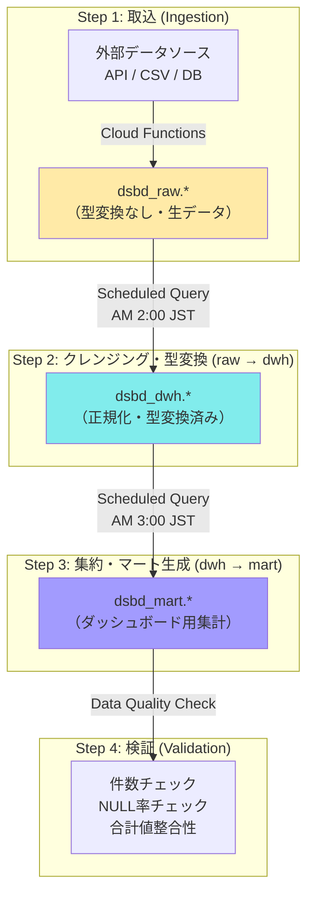

# BigQuery ETL設計・実行ガイド

## 概要

ローデータ（raw層）からダッシュボード接続先のデータマート（mart層）までを
SQLベースのETLで変換する設計。Claude Codeが各SQLを生成・実行・検証するための定義。

## ETLアーキテクチャ



## ETL実行スケジュール

| ステップ | 対象 | 実行時刻 (JST) | 依存先 | 想定実行時間 |
|---------|------|---------------|--------|------------|
| 1. Ingestion | raw_sales, raw_customers, raw_products | AM 1:00 | 外部API | ~10分 |
| 2. raw → dwh | fact_sales, dim_* | AM 2:00 | Step 1 完了 | ~15分 |
| 3. dwh → mart (日次) | mart_sales_daily, mart_category_summary, mart_customer_segments, mart_kpi_summary | AM 3:00 | Step 2 完了 | ~20分 |
| 4. dwh → mart (月次) | mart_sales_monthly | 毎月1日 AM 4:00 | Step 3 完了 | ~10分 |
| 5. Validation | 全mart | AM 3:30 / AM 4:30 | Step 3/4 完了 | ~5分 |

---

## ETL SQL定義

### Step 2-1: raw_sales → fact_sales（クレンジング・型変換）

```sql
-- ================================================================
-- ETL: raw_sales → fact_sales
-- 目的: ローデータの型変換、クレンジング、重複排除
-- 実行: BigQuery Scheduled Query (日次 AM 2:00 JST)
-- ================================================================

MERGE `{PROJECT}.dsbd_dwh.fact_sales` AS target
USING (
  SELECT
    -- UUID生成（冪等性のためraw_idベース）
    TO_HEX(MD5(CONCAT(raw_id, transaction_date))) AS sale_id,

    -- 日付: 複数形式を正規化
    SAFE.PARSE_DATE('%Y-%m-%d',
      REPLACE(transaction_date, '/', '-')
    ) AS transaction_date,

    product_code,
    customer_id,

    -- 数値変換: 文字列 → INT64
    SAFE_CAST(quantity AS INT64) AS quantity,

    -- 金額変換: 通貨記号・カンマ除去 → NUMERIC
    SAFE_CAST(
      REGEXP_REPLACE(unit_price, r'[¥$,\\s]', '')
      AS NUMERIC
    ) AS unit_price,

    SAFE_CAST(
      REGEXP_REPLACE(total_amount, r'[¥$,\\s]', '')
      AS NUMERIC
    ) AS total_amount,

    COALESCE(currency, 'JPY') AS currency,
    channel,
    region_code,
    CURRENT_TIMESTAMP() AS created_at,

    -- 重複排除: raw_id + transaction_date で一意化（最新取込を優先）
    ROW_NUMBER() OVER (
      PARTITION BY raw_id, transaction_date
      ORDER BY _ingested_at DESC
    ) AS _row_num

  FROM `{PROJECT}.dsbd_raw.raw_sales`
  WHERE
    -- インクリメンタル: 前日以降に取り込まれたレコードのみ
    DATE(_ingested_at) >= DATE_SUB(CURRENT_DATE(), INTERVAL 1 DAY)
    -- NULL/不正データ除外
    AND raw_id IS NOT NULL
    AND transaction_date IS NOT NULL
) AS source
ON target.sale_id = source.sale_id
WHEN NOT MATCHED AND source._row_num = 1 THEN
  INSERT (sale_id, transaction_date, product_code, customer_id,
          quantity, unit_price, total_amount, currency, channel,
          region_code, created_at)
  VALUES (source.sale_id, source.transaction_date, source.product_code,
          source.customer_id, source.quantity, source.unit_price,
          source.total_amount, source.currency, source.channel,
          source.region_code, source.created_at);
```

### Step 2-2: raw_customers → dim_customers（SCD Type 2）

```sql
-- ================================================================
-- ETL: raw_customers → dim_customers (SCD Type 2)
-- 目的: 顧客マスタの履歴管理付き更新
-- ================================================================

-- 1. 既存レコードのクローズ（変更があった場合）
UPDATE `{PROJECT}.dsbd_dwh.dim_customers` AS target
SET
  valid_to = CURRENT_TIMESTAMP(),
  is_current = FALSE
WHERE
  is_current = TRUE
  AND customer_id IN (
    SELECT customer_id
    FROM `{PROJECT}.dsbd_raw.raw_customers`
    WHERE DATE(_ingested_at) >= DATE_SUB(CURRENT_DATE(), INTERVAL 1 DAY)
  )
  AND EXISTS (
    SELECT 1
    FROM `{PROJECT}.dsbd_raw.raw_customers` AS src
    WHERE src.customer_id = target.customer_id
      AND DATE(src._ingested_at) >= DATE_SUB(CURRENT_DATE(), INTERVAL 1 DAY)
      AND (
        COALESCE(src.segment, '') != COALESCE(target.segment, '')
        OR COALESCE(src.is_active, '') != CAST(target.is_active AS STRING)
      )
  );

-- 2. 新規・変更レコードのINSERT
INSERT INTO `{PROJECT}.dsbd_dwh.dim_customers`
  (customer_id, customer_name, segment, prefecture_code, region_name,
   registered_date, is_active, valid_from, valid_to, is_current)
SELECT
  customer_id,
  name AS customer_name,
  COALESCE(segment, 'unknown') AS segment,
  prefecture_code,
  NULL AS region_name,  -- マスタ結合は別途
  SAFE.PARSE_DATE('%Y-%m-%d', registered_date) AS registered_date,
  CASE LOWER(COALESCE(is_active, 'true'))
    WHEN 'true' THEN TRUE
    WHEN '1' THEN TRUE
    ELSE FALSE
  END AS is_active,
  CURRENT_TIMESTAMP() AS valid_from,
  NULL AS valid_to,
  TRUE AS is_current
FROM `{PROJECT}.dsbd_raw.raw_customers`
WHERE
  DATE(_ingested_at) >= DATE_SUB(CURRENT_DATE(), INTERVAL 1 DAY)
  AND customer_id IS NOT NULL
QUALIFY ROW_NUMBER() OVER (
  PARTITION BY customer_id ORDER BY _ingested_at DESC
) = 1;
```

### Step 2-3: raw_products → dim_products

```sql
-- ================================================================
-- ETL: raw_products → dim_products
-- 目的: 商品マスタの正規化・粗利率算出
-- ================================================================

MERGE `{PROJECT}.dsbd_dwh.dim_products` AS target
USING (
  SELECT
    product_code,
    product_name,
    COALESCE(category_l1, '未分類') AS category_l1,
    category_l2,
    category_l3,
    SAFE_CAST(REGEXP_REPLACE(list_price, r'[¥$,]', '') AS NUMERIC) AS list_price,
    SAFE_CAST(REGEXP_REPLACE(cost_price, r'[¥$,]', '') AS NUMERIC) AS cost_price,
    -- 粗利率 = (定価 - 原価) / 定価
    SAFE_DIVIDE(
      SAFE_CAST(REGEXP_REPLACE(list_price, r'[¥$,]', '') AS NUMERIC)
      - SAFE_CAST(REGEXP_REPLACE(cost_price, r'[¥$,]', '') AS NUMERIC),
      SAFE_CAST(REGEXP_REPLACE(list_price, r'[¥$,]', '') AS NUMERIC)
    ) AS profit_margin,
    COALESCE(status, 'active') AS status
  FROM `{PROJECT}.dsbd_raw.raw_products`
  WHERE product_code IS NOT NULL
  QUALIFY ROW_NUMBER() OVER (
    PARTITION BY product_code ORDER BY _ingested_at DESC
  ) = 1
) AS source
ON target.product_code = source.product_code
WHEN MATCHED THEN
  UPDATE SET
    product_name = source.product_name,
    category_l1 = source.category_l1,
    category_l2 = source.category_l2,
    category_l3 = source.category_l3,
    list_price = source.list_price,
    cost_price = source.cost_price,
    profit_margin = source.profit_margin,
    status = source.status
WHEN NOT MATCHED THEN
  INSERT (product_code, product_name, category_l1, category_l2, category_l3,
          list_price, cost_price, profit_margin, status)
  VALUES (source.product_code, source.product_name, source.category_l1,
          source.category_l2, source.category_l3, source.list_price,
          source.cost_price, source.profit_margin, source.status);
```

### Step 3-1: dwh → mart_sales_daily（日次売上マート）

```sql
-- ================================================================
-- ETL: dwh → mart_sales_daily
-- 目的: ダッシュボードの日次トレンドグラフ・KPIカード用集計
-- 接続先UI: LineChart (日次推移), KPIカード (売上/注文数/顧客数)
-- ================================================================

CREATE OR REPLACE TABLE `{PROJECT}.dsbd_mart.mart_sales_daily`
PARTITION BY date
CLUSTER BY channel, category_l1, region_code
AS
WITH daily AS (
  SELECT
    f.transaction_date AS date,
    f.channel,
    f.region_code,
    p.category_l1,
    SUM(f.total_amount) AS total_sales,
    SUM(f.quantity) AS total_quantity,
    COUNT(*) AS order_count,
    COUNT(DISTINCT f.customer_id) AS unique_customers,
    SAFE_DIVIDE(SUM(f.total_amount), COUNT(*)) AS avg_order_value
  FROM `{PROJECT}.dsbd_dwh.fact_sales` AS f
  LEFT JOIN `{PROJECT}.dsbd_dwh.dim_products` AS p
    ON f.product_code = p.product_code
  GROUP BY 1, 2, 3, 4
)
SELECT
  d.*,
  -- 前日売上（前日比計算用）
  LAG(d.total_sales) OVER (
    PARTITION BY d.channel, d.region_code, d.category_l1
    ORDER BY d.date
  ) AS prev_day_sales,
  -- 前週同曜日売上（週次比較用）
  LAG(d.total_sales, 7) OVER (
    PARTITION BY d.channel, d.region_code, d.category_l1
    ORDER BY d.date
  ) AS wow_sales
FROM daily AS d;
```

### Step 3-2: dwh → mart_category_summary（カテゴリ別集計）

```sql
-- ================================================================
-- ETL: dwh → mart_category_summary
-- 接続先UI: PieChart (カテゴリ構成比), BarChart (カテゴリ比較)
-- ================================================================

CREATE OR REPLACE TABLE `{PROJECT}.dsbd_mart.mart_category_summary`
PARTITION BY date
AS
SELECT
  f.transaction_date AS date,
  p.category_l1,
  p.category_l2,
  SUM(f.total_amount) AS total_sales,
  -- 売上構成比（当日の全カテゴリ合計に対する比率）
  ROUND(
    SAFE_DIVIDE(
      SUM(f.total_amount),
      SUM(SUM(f.total_amount)) OVER (PARTITION BY f.transaction_date)
    ) * 100, 2
  ) AS sales_ratio,
  SUM(f.quantity) AS total_quantity,
  COUNT(DISTINCT f.product_code) AS product_count
FROM `{PROJECT}.dsbd_dwh.fact_sales` AS f
LEFT JOIN `{PROJECT}.dsbd_dwh.dim_products` AS p
  ON f.product_code = p.product_code
GROUP BY 1, 2, 3;
```

### Step 3-3: dwh → mart_kpi_summary（KPIサマリ）

```sql
-- ================================================================
-- ETL: dwh → mart_kpi_summary
-- 接続先UI: ダッシュボードトップ KPIカード4枚
-- KPI: total_sales / order_count / unique_customers / avg_order_value
-- ================================================================

CREATE OR REPLACE TABLE `{PROJECT}.dsbd_mart.mart_kpi_summary`
PARTITION BY date
AS
WITH today_kpi AS (
  SELECT
    date,
    SUM(total_sales) AS total_sales,
    SUM(order_count) AS order_count,
    SUM(unique_customers) AS unique_customers,
    SAFE_DIVIDE(SUM(total_sales), SUM(order_count)) AS avg_order_value
  FROM `{PROJECT}.dsbd_mart.mart_sales_daily`
  GROUP BY date
),
with_prev AS (
  SELECT
    t.*,
    LAG(t.total_sales) OVER (ORDER BY t.date) AS prev_total_sales,
    LAG(t.order_count) OVER (ORDER BY t.date) AS prev_order_count,
    LAG(t.unique_customers) OVER (ORDER BY t.date) AS prev_unique_customers,
    LAG(t.avg_order_value) OVER (ORDER BY t.date) AS prev_avg_order_value
  FROM today_kpi AS t
)
SELECT date, kpi_name, kpi_value, kpi_unit, change_rate,
  CASE
    WHEN change_rate > 1 THEN 'up'
    WHEN change_rate < -1 THEN 'down'
    ELSE 'flat'
  END AS trend
FROM with_prev
UNPIVOT (
  (kpi_value, prev_value) FOR kpi_name IN (
    (total_sales, prev_total_sales) AS 'total_sales',
    (order_count, prev_order_count) AS 'order_count',
    (unique_customers, prev_unique_customers) AS 'unique_customers',
    (avg_order_value, prev_avg_order_value) AS 'avg_order_value'
  )
)
CROSS JOIN UNNEST([
  STRUCT(
    kpi_name AS kpi_name,
    CASE kpi_name
      WHEN 'total_sales' THEN '円'
      WHEN 'order_count' THEN '件'
      WHEN 'unique_customers' THEN '人'
      WHEN 'avg_order_value' THEN '円'
    END AS kpi_unit,
    ROUND(SAFE_DIVIDE(kpi_value - prev_value, prev_value) * 100, 1) AS change_rate
  )
]);
```

### Step 4: dwh → mart_sales_monthly（月次集計）

```sql
-- ================================================================
-- ETL: mart_sales_daily → mart_sales_monthly
-- 実行: 毎月1日 AM 4:00 JST
-- 接続先UI: 月次比較 BarChart
-- ================================================================

CREATE OR REPLACE TABLE `{PROJECT}.dsbd_mart.mart_sales_monthly`
AS
WITH monthly AS (
  SELECT
    FORMAT_DATE('%Y-%m', date) AS year_month,
    channel,
    region_code,
    category_l1,
    SUM(total_sales) AS total_sales,
    SUM(total_quantity) AS total_quantity,
    SUM(order_count) AS order_count,
    SUM(unique_customers) AS unique_customers,
    SAFE_DIVIDE(SUM(total_sales), SUM(order_count)) AS avg_order_value
  FROM `{PROJECT}.dsbd_mart.mart_sales_daily`
  GROUP BY 1, 2, 3, 4
)
SELECT
  m.*,
  -- 前月比
  ROUND(SAFE_DIVIDE(
    m.total_sales - LAG(m.total_sales) OVER w,
    LAG(m.total_sales) OVER w
  ) * 100, 1) AS mom_growth_rate,
  -- 前年同月比
  ROUND(SAFE_DIVIDE(
    m.total_sales - LAG(m.total_sales, 12) OVER w,
    LAG(m.total_sales, 12) OVER w
  ) * 100, 1) AS yoy_growth_rate
FROM monthly AS m
WINDOW w AS (
  PARTITION BY m.channel, m.region_code, m.category_l1
  ORDER BY m.year_month
);
```

---

## データ品質チェック SQL

ETL完了後に実行し、異常があればSlack通知。

```sql
-- ================================================================
-- Data Quality Check: mart層の整合性検証
-- 実行: 各ETL完了後
-- ================================================================

WITH checks AS (
  -- Check 1: 今日のデータが存在するか
  SELECT 'mart_sales_daily: 今日のデータ存在' AS check_name,
    CASE WHEN COUNT(*) > 0 THEN 'PASS' ELSE 'FAIL' END AS result,
    COUNT(*) AS detail
  FROM `{PROJECT}.dsbd_mart.mart_sales_daily`
  WHERE date = CURRENT_DATE()

  UNION ALL

  -- Check 2: 売上がマイナスでないか
  SELECT 'mart_sales_daily: 負の売上',
    CASE WHEN COUNT(*) = 0 THEN 'PASS' ELSE 'FAIL' END,
    COUNT(*)
  FROM `{PROJECT}.dsbd_mart.mart_sales_daily`
  WHERE total_sales < 0

  UNION ALL

  -- Check 3: KPIサマリが4レコード揃っているか
  SELECT 'mart_kpi_summary: KPIレコード数',
    CASE WHEN COUNT(DISTINCT kpi_name) = 4 THEN 'PASS' ELSE 'FAIL' END,
    COUNT(DISTINCT kpi_name)
  FROM `{PROJECT}.dsbd_mart.mart_kpi_summary`
  WHERE date = CURRENT_DATE()

  UNION ALL

  -- Check 4: raw→dwhのレコード欠損率
  SELECT 'fact_sales: 変換欠損率',
    CASE WHEN SAFE_DIVIDE(raw_cnt - dwh_cnt, raw_cnt) < 0.01 THEN 'PASS' ELSE 'WARN' END,
    raw_cnt - dwh_cnt
  FROM (
    SELECT
      (SELECT COUNT(*) FROM `{PROJECT}.dsbd_raw.raw_sales`
       WHERE DATE(_ingested_at) = CURRENT_DATE()) AS raw_cnt,
      (SELECT COUNT(*) FROM `{PROJECT}.dsbd_dwh.fact_sales`
       WHERE DATE(created_at) = CURRENT_DATE()) AS dwh_cnt
  )

  UNION ALL

  -- Check 5: NULL率チェック（主要カラム）
  SELECT 'fact_sales: product_code NULL率',
    CASE WHEN SAFE_DIVIDE(null_cnt, total_cnt) < 0.001 THEN 'PASS' ELSE 'WARN' END,
    null_cnt
  FROM (
    SELECT
      COUNTIF(product_code IS NULL) AS null_cnt,
      COUNT(*) AS total_cnt
    FROM `{PROJECT}.dsbd_dwh.fact_sales`
    WHERE DATE(created_at) = CURRENT_DATE()
  )
)
SELECT * FROM checks
ORDER BY CASE result WHEN 'FAIL' THEN 0 WHEN 'WARN' THEN 1 ELSE 2 END;
```

---

## Claude CodeによるETL開発・実行ルール

### 開発時

1. **SQLファイル管理:** `sql/etl/` ディレクトリにSQLファイルを配置
2. **命名規則:** `{step}_{source}_to_{target}.sql` (例: `02_raw_sales_to_fact_sales.sql`)
3. **テスト:** stg環境で `LIMIT 1000` 付きで動作確認後、本番適用
4. **レビュー:** ETL SQLの変更は必ずPRレビューを経る

### 実行コマンド

```bash
# stg環境でETL実行（Claude Codeから実行可能）
bq query --project_id={PROJECT_STG} --use_legacy_sql=false < sql/etl/02_raw_sales_to_fact_sales.sql

# データ品質チェック
bq query --project_id={PROJECT_STG} --use_legacy_sql=false < sql/etl/99_quality_check.sql

# 本番実行は禁止 — Scheduled Queryまたは承認フローを経由
```

### Claude Code実行制約

| 操作 | stg環境 | prod環境 |
|------|---------|---------|
| SELECT (読み取り) | 許可 | 禁止 |
| CREATE/REPLACE TABLE | 許可 | 禁止 |
| INSERT/UPDATE/DELETE/MERGE | 許可 | 禁止 |
| DROP TABLE | 禁止 | 禁止 |
| Scheduled Query登録 | 許可 | 人間の承認必須 |

### ダッシュボードUI ↔ mart層マッピング

| UI要素 | 接続先mart | 主要カラム |
|--------|-----------|-----------|
| KPIカード (4枚) | mart_kpi_summary | kpi_name, kpi_value, change_rate, trend |
| 日次トレンド LineChart | mart_sales_daily | date, total_sales (フィルタ: channel, category_l1) |
| カテゴリ構成比 PieChart | mart_category_summary | category_l1, sales_ratio |
| 月次比較 BarChart | mart_sales_monthly | year_month, total_sales, mom_growth_rate |
| 顧客セグメント BarChart | mart_customer_segments | segment, total_sales, customer_count |
| データテーブル | mart_sales_daily | 全カラム (ページネーション + ソート) |
