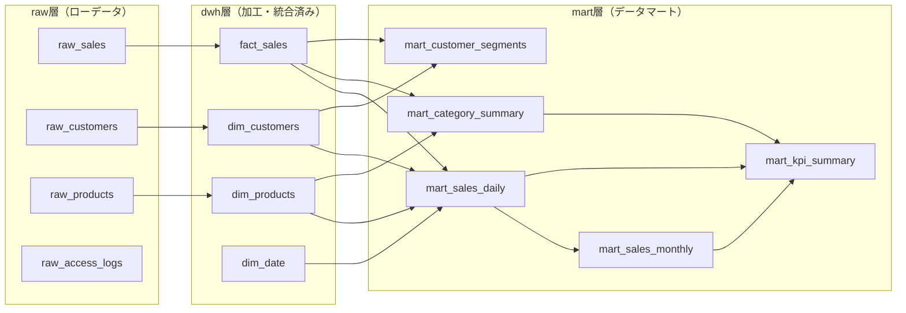

# BigQueryスキーマ設計書

## データセット構成



## データセット一覧

| データセットID | 用途 | 環境 | 保持ポリシー |
|--------------|------|------|------------|
| `dsbd_raw` | ローデータ取込先 | prod | 365日 |
| `dsbd_dwh` | 加工・統合データ | prod | 無期限 |
| `dsbd_mart` | ダッシュボード用データマート | prod | 無期限 |
| `dsbd_raw_stg` | ローデータ（ステージング） | stg | 30日 |
| `dsbd_dwh_stg` | 加工データ（ステージング） | stg | 90日 |
| `dsbd_mart_stg` | データマート（ステージング） | stg | 90日 |

---

## raw層: ローデータスキーマ

### raw_sales（売上ローデータ）

外部システムから取り込まれる生データ。変換せずそのまま格納。

| カラム名 | 型 | モード | 説明 |
|---------|---|--------|------|
| raw_id | STRING | REQUIRED | ソースシステムのレコードID |
| transaction_date | STRING | REQUIRED | 取引日（ソース形式: "YYYY-MM-DD" or "YYYY/MM/DD"） |
| product_code | STRING | REQUIRED | 商品コード |
| customer_id | STRING | NULLABLE | 顧客ID |
| quantity | STRING | REQUIRED | 数量（ソースは文字列） |
| unit_price | STRING | REQUIRED | 単価（ソースは文字列、通貨記号含む場合あり） |
| total_amount | STRING | REQUIRED | 合計金額 |
| currency | STRING | NULLABLE | 通貨コード (JPY/USD等) |
| channel | STRING | NULLABLE | 販売チャネル (web/store/api) |
| region_code | STRING | NULLABLE | 地域コード |
| raw_json | JSON | NULLABLE | ソースのオリジナルJSONペイロード |
| _ingested_at | TIMESTAMP | REQUIRED | 取込日時（自動付与） |
| _source_file | STRING | NULLABLE | 取込元ファイル名/API名 |

**パーティション:** `_ingested_at` で日付パーティション
**クラスタリング:** `product_code`, `customer_id`

#### サンプルデータ

```json
[
  {
    "raw_id": "TXN-2026-00001",
    "transaction_date": "2026-01-15",
    "product_code": "PRD-A001",
    "customer_id": "CST-1001",
    "quantity": "3",
    "unit_price": "¥1,200",
    "total_amount": "3600",
    "currency": "JPY",
    "channel": "web",
    "region_code": "JP-13",
    "raw_json": null,
    "_ingested_at": "2026-01-15T10:30:00Z",
    "_source_file": "sales_api_20260115"
  },
  {
    "raw_id": "TXN-2026-00002",
    "transaction_date": "2026-01-15",
    "product_code": "PRD-B003",
    "customer_id": "CST-2045",
    "quantity": "1",
    "unit_price": "5800",
    "total_amount": "5800",
    "currency": "JPY",
    "channel": "store",
    "region_code": "JP-27",
    "raw_json": null,
    "_ingested_at": "2026-01-15T10:30:00Z",
    "_source_file": "sales_api_20260115"
  }
]
```

### raw_customers（顧客ローデータ）

| カラム名 | 型 | モード | 説明 |
|---------|---|--------|------|
| customer_id | STRING | REQUIRED | 顧客ID |
| name | STRING | NULLABLE | 顧客名 |
| email | STRING | NULLABLE | メールアドレス（PII） |
| segment | STRING | NULLABLE | 顧客セグメント (enterprise/smb/individual) |
| registered_date | STRING | NULLABLE | 登録日 |
| prefecture_code | STRING | NULLABLE | 都道府県コード |
| is_active | STRING | NULLABLE | アクティブフラグ ("true"/"false") |
| _ingested_at | TIMESTAMP | REQUIRED | 取込日時 |

**パーティション:** `_ingested_at` で日付パーティション
**注意:** `email`, `name` はPII。本番ではカラムレベルアクセス制御を適用。

### raw_products（商品ローデータ）

| カラム名 | 型 | モード | 説明 |
|---------|---|--------|------|
| product_code | STRING | REQUIRED | 商品コード |
| product_name | STRING | REQUIRED | 商品名 |
| category_l1 | STRING | NULLABLE | 大カテゴリ |
| category_l2 | STRING | NULLABLE | 中カテゴリ |
| category_l3 | STRING | NULLABLE | 小カテゴリ |
| list_price | STRING | NULLABLE | 定価 |
| cost_price | STRING | NULLABLE | 原価 |
| status | STRING | NULLABLE | ステータス (active/discontinued) |
| _ingested_at | TIMESTAMP | REQUIRED | 取込日時 |

### raw_access_logs（アクセスログ）

| カラム名 | 型 | モード | 説明 |
|---------|---|--------|------|
| request_id | STRING | REQUIRED | リクエストID |
| timestamp | STRING | REQUIRED | アクセス日時 |
| user_id | STRING | NULLABLE | ログインユーザーID |
| path | STRING | REQUIRED | アクセスパス |
| method | STRING | REQUIRED | HTTPメソッド |
| status_code | STRING | REQUIRED | レスポンスステータス |
| response_time_ms | STRING | NULLABLE | レスポンスタイム(ms) |
| user_agent | STRING | NULLABLE | User-Agent |
| _ingested_at | TIMESTAMP | REQUIRED | 取込日時 |

---

## dwh層: 統合・正規化スキーマ

### fact_sales（売上ファクト）

raw_salesを型変換・クレンジングした正規化テーブル。

| カラム名 | 型 | モード | 説明 |
|---------|---|--------|------|
| sale_id | STRING | REQUIRED | 売上ID (UUID生成) |
| transaction_date | DATE | REQUIRED | 取引日 |
| product_code | STRING | REQUIRED | 商品コード → dim_products FK |
| customer_id | STRING | NULLABLE | 顧客ID → dim_customers FK |
| quantity | INT64 | REQUIRED | 数量 |
| unit_price | NUMERIC | REQUIRED | 単価 (通貨記号除去・数値変換済み) |
| total_amount | NUMERIC | REQUIRED | 合計金額 |
| currency | STRING | REQUIRED | 通貨コード (デフォルト: JPY) |
| channel | STRING | NULLABLE | 販売チャネル |
| region_code | STRING | NULLABLE | 地域コード |
| created_at | TIMESTAMP | REQUIRED | レコード作成日時 |

**パーティション:** `transaction_date` で日付パーティション
**クラスタリング:** `product_code`, `customer_id`, `channel`

### dim_customers（顧客ディメンション）

| カラム名 | 型 | モード | 説明 |
|---------|---|--------|------|
| customer_id | STRING | REQUIRED | 顧客ID (PK) |
| customer_name | STRING | NULLABLE | 顧客名 |
| segment | STRING | REQUIRED | 顧客セグメント |
| prefecture_code | STRING | NULLABLE | 都道府県コード |
| region_name | STRING | NULLABLE | 地域名（マスタ結合済み） |
| registered_date | DATE | NULLABLE | 登録日 |
| is_active | BOOL | REQUIRED | アクティブフラグ |
| valid_from | TIMESTAMP | REQUIRED | SCD Type 2 有効開始 |
| valid_to | TIMESTAMP | NULLABLE | SCD Type 2 有効終了 |
| is_current | BOOL | REQUIRED | 最新レコードフラグ |

### dim_products（商品ディメンション）

| カラム名 | 型 | モード | 説明 |
|---------|---|--------|------|
| product_code | STRING | REQUIRED | 商品コード (PK) |
| product_name | STRING | REQUIRED | 商品名 |
| category_l1 | STRING | REQUIRED | 大カテゴリ |
| category_l2 | STRING | NULLABLE | 中カテゴリ |
| category_l3 | STRING | NULLABLE | 小カテゴリ |
| list_price | NUMERIC | NULLABLE | 定価 |
| cost_price | NUMERIC | NULLABLE | 原価 |
| profit_margin | FLOAT64 | NULLABLE | 粗利率 |
| status | STRING | REQUIRED | ステータス |

### dim_date（日付ディメンション）

| カラム名 | 型 | モード | 説明 |
|---------|---|--------|------|
| date_key | DATE | REQUIRED | 日付 (PK) |
| year | INT64 | REQUIRED | 年 |
| quarter | INT64 | REQUIRED | 四半期 (1-4) |
| month | INT64 | REQUIRED | 月 (1-12) |
| week_of_year | INT64 | REQUIRED | 年間週番号 |
| day_of_week | INT64 | REQUIRED | 曜日 (1=月, 7=日) |
| day_of_week_name | STRING | REQUIRED | 曜日名 |
| is_weekend | BOOL | REQUIRED | 週末フラグ |
| is_holiday | BOOL | REQUIRED | 祝日フラグ |
| fiscal_year | INT64 | REQUIRED | 会計年度 |
| fiscal_quarter | INT64 | REQUIRED | 会計四半期 |

---

## mart層: データマートスキーマ

ダッシュボード画面の最終アウトプットから逆算した接続先テーブル。

### mart_sales_daily（日次売上サマリ）

**用途:** KPIカード、日次トレンドグラフ（LineChart/AreaChart）

| カラム名 | 型 | モード | 説明 |
|---------|---|--------|------|
| date | DATE | REQUIRED | 対象日 |
| channel | STRING | REQUIRED | 販売チャネル |
| region_code | STRING | REQUIRED | 地域コード |
| category_l1 | STRING | REQUIRED | 大カテゴリ |
| total_sales | NUMERIC | REQUIRED | 売上合計 |
| total_quantity | INT64 | REQUIRED | 販売数量合計 |
| order_count | INT64 | REQUIRED | 注文件数 |
| unique_customers | INT64 | REQUIRED | ユニーク顧客数 |
| avg_order_value | NUMERIC | REQUIRED | 平均注文額 |
| prev_day_sales | NUMERIC | NULLABLE | 前日売上（前日比計算用） |
| wow_sales | NUMERIC | NULLABLE | 前週同曜日売上 |

**パーティション:** `date`
**クラスタリング:** `channel`, `category_l1`, `region_code`

### mart_sales_monthly（月次売上サマリ）

**用途:** 月次比較BarChart、KPI前月比

| カラム名 | 型 | モード | 説明 |
|---------|---|--------|------|
| year_month | STRING | REQUIRED | 年月 (YYYY-MM) |
| channel | STRING | REQUIRED | 販売チャネル |
| region_code | STRING | REQUIRED | 地域コード |
| category_l1 | STRING | REQUIRED | 大カテゴリ |
| total_sales | NUMERIC | REQUIRED | 月間売上合計 |
| total_quantity | INT64 | REQUIRED | 月間販売数量 |
| order_count | INT64 | REQUIRED | 月間注文件数 |
| unique_customers | INT64 | REQUIRED | 月間ユニーク顧客数 |
| avg_order_value | NUMERIC | REQUIRED | 月間平均注文額 |
| mom_growth_rate | FLOAT64 | NULLABLE | 前月比成長率(%) |
| yoy_growth_rate | FLOAT64 | NULLABLE | 前年同月比成長率(%) |

### mart_category_summary（カテゴリ別集計）

**用途:** PieChart（構成比）、カテゴリ別BarChart

| カラム名 | 型 | モード | 説明 |
|---------|---|--------|------|
| date | DATE | REQUIRED | 集計対象日 |
| category_l1 | STRING | REQUIRED | 大カテゴリ |
| category_l2 | STRING | NULLABLE | 中カテゴリ |
| total_sales | NUMERIC | REQUIRED | 売上合計 |
| sales_ratio | FLOAT64 | REQUIRED | 売上構成比(%) |
| total_quantity | INT64 | REQUIRED | 販売数量 |
| product_count | INT64 | REQUIRED | 商品数 |

### mart_customer_segments（顧客セグメント別集計）

**用途:** 顧客分析セクション、セグメント別BarChart

| カラム名 | 型 | モード | 説明 |
|---------|---|--------|------|
| date | DATE | REQUIRED | 集計対象日 |
| segment | STRING | REQUIRED | 顧客セグメント |
| customer_count | INT64 | REQUIRED | 顧客数 |
| total_sales | NUMERIC | REQUIRED | セグメント別売上 |
| avg_sales_per_customer | NUMERIC | REQUIRED | 顧客単価 |
| repeat_rate | FLOAT64 | NULLABLE | リピート率(%) |

### mart_kpi_summary（KPIサマリ）

**用途:** ダッシュボードトップのKPIカード4枚に直接接続

| カラム名 | 型 | モード | 説明 |
|---------|---|--------|------|
| date | DATE | REQUIRED | 対象日 |
| kpi_name | STRING | REQUIRED | KPI名 |
| kpi_value | NUMERIC | REQUIRED | KPI値 |
| kpi_unit | STRING | REQUIRED | 単位 (円/件/人/%) |
| change_rate | FLOAT64 | NULLABLE | 前期比(%) |
| trend | STRING | NULLABLE | トレンド (up/down/flat) |

#### mart_kpi_summary サンプルデータ

```json
[
  { "date": "2026-01-15", "kpi_name": "total_sales", "kpi_value": 12500000, "kpi_unit": "円", "change_rate": 5.2, "trend": "up" },
  { "date": "2026-01-15", "kpi_name": "order_count", "kpi_value": 1847, "kpi_unit": "件", "change_rate": -2.1, "trend": "down" },
  { "date": "2026-01-15", "kpi_name": "unique_customers", "kpi_value": 1203, "kpi_unit": "人", "change_rate": 8.7, "trend": "up" },
  { "date": "2026-01-15", "kpi_name": "avg_order_value", "kpi_value": 6768, "kpi_unit": "円", "change_rate": 0.3, "trend": "flat" }
]
```

---

## アクセス制御

| ロール | raw | dwh | mart | 権限 |
|--------|-----|-----|------|------|
| Cloud Run SA | x | x | READ | bigquery.dataViewer（mart層のみ） |
| データエンジニア | READ/WRITE | READ/WRITE | READ/WRITE | bigquery.dataEditor |
| ETLサービスアカウント | READ | READ/WRITE | READ/WRITE | bigquery.dataEditor |
| 管理者 | ALL | ALL | ALL | bigquery.admin |
| Claude Code (開発時) | READ | READ | READ | bigquery.dataViewer (stg環境のみ) |

**原則:**
- Cloud Runアプリケーションは **mart層のみ** 読み取り可能（raw/dwhへの直接アクセス禁止）
- PIIカラム (email, name) にはカラムレベルアクセス制御を適用
- Claude Codeはstg環境のみ参照可能（prod直接アクセス禁止）
