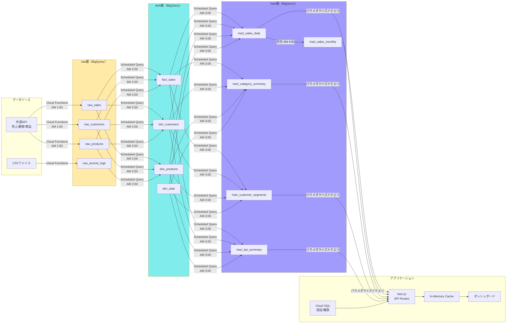

# データパイプライン設計書

## データフロー図（3層アーキテクチャ）

**詳細スキーマ・ETL SQL:** `docs/02_design/bigquery-schema.md`, `docs/02_design/bigquery-etl-design.md` 参照

## データ層の役割

| 層 | データセット | 役割 | 書き込み元 | 読み取り元 |
|----|------------|------|-----------|-----------|
| raw | `dsbd_raw` | ソースそのまま格納。型変換なし | Cloud Functions | ETL (Scheduled Query) |
| dwh | `dsbd_dwh` | 型変換・クレンジング・正規化済み | ETL (Scheduled Query) | mart生成クエリ |
| mart | `dsbd_mart` | ダッシュボードUIに直結する集計テーブル | ETL (Scheduled Query) | Cloud Run (API Routes) |

**原則: Cloud Runアプリはmart層のみ参照。raw/dwhへの直接アクセスは禁止。**

## ETL実行スケジュール

| 時刻 (JST) | ステップ | 処理 | 依存先 |
|------------|---------|------|--------|
| AM 1:00 | Ingestion | 外部API → raw_* | なし |
| AM 2:00 | raw → dwh | クレンジング + 型変換 | Ingestion完了 |
| AM 3:00 | dwh → mart (日次) | 日次/カテゴリ/セグメント/KPI集計 | raw→dwh完了 |
| AM 3:30 | Validation | データ品質チェック | mart生成完了 |
| 月1日 AM 4:00 | dwh → mart (月次) | 月次売上マート + YoY/MoM | 日次mart完了 |

## BigQueryテーブル設計方針

| 設計方針 | 詳細 |
|---------|------|
| パーティショニング | 日付パーティション（transaction_date, date） → 課金最適化 |
| クラスタリング | クエリ頻度の高い絞り込みカラム (channel, category_l1, region_code) |
| インクリメンタル処理 | MERGE文で差分更新（全テーブル再作成を避ける） |
| SCD Type 2 | dim_customers: 履歴管理 (valid_from, valid_to, is_current) |
| 重複排除 | ROW_NUMBER + PARTITION BY で最新レコードを採用 |
| データ保持期間 | raw: 365日, dwh: 無期限, mart: 無期限 |

## スケジュールドクエリ

| クエリ名 | 頻度 | 入力 → 出力 | SQL参照 |
|---------|------|------------|---------|
| etl_raw_to_fact_sales | 日次 AM 2:00 | raw_sales → fact_sales | `sql/etl/02_raw_sales_to_fact_sales.sql` |
| etl_raw_to_dim_customers | 日次 AM 2:00 | raw_customers → dim_customers | `sql/etl/02_raw_customers_to_dim_customers.sql` |
| etl_raw_to_dim_products | 日次 AM 2:00 | raw_products → dim_products | `sql/etl/02_raw_products_to_dim_products.sql` |
| etl_dwh_to_mart_daily | 日次 AM 3:00 | dwh → mart_sales_daily | `sql/etl/03_dwh_to_mart_sales_daily.sql` |
| etl_dwh_to_mart_category | 日次 AM 3:00 | dwh → mart_category_summary | `sql/etl/03_dwh_to_mart_category_summary.sql` |
| etl_dwh_to_mart_kpi | 日次 AM 3:00 | dwh → mart_kpi_summary | `sql/etl/03_dwh_to_mart_kpi_summary.sql` |
| etl_mart_to_monthly | 月次 1日 AM 4:00 | mart_sales_daily → mart_sales_monthly | `sql/etl/04_mart_to_mart_sales_monthly.sql` |
| data_quality_check | 日次 AM 3:30 | mart_* → 品質レポート | `sql/etl/99_quality_check.sql` |

## APIレイヤでのクエリ最適化

| 方針 | 詳細 |
|------|------|
| キャッシュ | TanStack Query (クライアント staleTime: 5分) + In-Memory Cache (サーバー TTL: 5分) |
| パラメタライズドクエリ | BigQuery パラメータバインド使用（SQLインジェクション防止: `src/lib/bigquery-client.ts`） |
| クエリ結果集約 | ダッシュボード表示に必要な集計は全てmart層で事前計算。API側での追加集計を最小化 |
| クエリコスト制限 | BigQuery クエリあたりのスキャン上限設定（本番: 10GB） |

## ダッシュボードUI ↔ mart層マッピング

| UI要素 | 接続先mart | フィルタパラメータ |
|--------|-----------|-----------------|
| KPIカード (4枚) | mart_kpi_summary | date |
| 日次トレンド LineChart | mart_sales_daily | date, channel, category_l1, region_code |
| カテゴリ PieChart | mart_category_summary | date, category_l1 |
| 月次比較 BarChart | mart_sales_monthly | year_month, channel |
| 顧客セグメント BarChart | mart_customer_segments | date, segment |
| データテーブル | mart_sales_daily | 全フィルタ + ページネーション |

## バッチ処理スケジュール

| バッチ名 | 頻度 | 実行方式 | 処理内容 |
|---------|------|---------|---------|
| sales_ingestion | 日次 AM 1:00 | Cloud Scheduler + Cloud Functions | 売上API → raw_sales |
| customer_sync | 日次 AM 1:00 | Cloud Scheduler + Cloud Functions | 顧客マスタAPI → raw_customers |
| product_sync | 日次 AM 1:00 | Cloud Scheduler + Cloud Functions | 商品マスタAPI → raw_products |
| log_aggregation | 日次 AM 1:30 | Cloud Scheduler + Cloud Functions | ログ取得 → raw_access_logs |
