# 権限管理ページ 定義・設計・実行ガイド

## 概要

Admin ロールのユーザーのみアクセス可能な権限管理ページ。
ユーザーの招待・ロール変更・アカウント無効化を行う。

**アクセスURL:** `/settings/users`
**必要ロール:** ADMIN のみ

---

## 画面構成

### ユーザー管理画面 (SCR-004-A: /settings/users)

```
┌─────────────────────────────────────────────────────────┐
│  [← 設定]  ユーザー管理                                   │
├─────────────────────────────────────────────────────────┤
│                                                         │
│  ┌─────────────────────┐  ┌──────────────────────────┐  │
│  │ 🔍 ユーザーを検索... │  │ + ユーザーを招待          │  │
│  └─────────────────────┘  └──────────────────────────┘  │
│                                                         │
│  ロール: [すべて ▼]  ステータス: [すべて ▼]              │
│                                                         │
│  ┌───────────────────────────────────────────────────┐  │
│  │ 名前          │ メール           │ ロール │ 状態  │  │
│  ├───────────────┼─────────────────┼────────┼───────┤  │
│  │ 山田 太郎     │ yamada@ex.com   │ Admin  │ 有効  │  │
│  │ 佐藤 花子     │ sato@ex.com     │ Editor │ 有効  │  │
│  │ 鈴木 一郎     │ suzuki@ex.com   │ Viewer │ 有効  │  │
│  │ 田中 次郎     │ tanaka@ex.com   │ Viewer │ 招待中│  │
│  │ 李 明         │ lee@partner.com │ Viewer │ ロック│  │
│  └───────────────────────────────────────────────────┘  │
│                                                         │
│  1-5 / 12件  [< 前へ] [1] [2] [3] [次へ >]              │
│                                                         │
└─────────────────────────────────────────────────────────┘
```

### ユーザー招待モーダル

```
┌──────────────────────────────────────┐
│  ユーザーを招待                [×]    │
├──────────────────────────────────────┤
│                                      │
│  メールアドレス *                     │
│  ┌──────────────────────────────┐    │
│  │ user@example.com             │    │
│  └──────────────────────────────┘    │
│                                      │
│  名前                                │
│  ┌──────────────────────────────┐    │
│  │                              │    │
│  └──────────────────────────────┘    │
│                                      │
│  ロール *                            │
│  ┌──────────────────────────────┐    │
│  │ Viewer                    ▼  │    │
│  └──────────────────────────────┘    │
│  ※ Viewer: 閲覧のみ                 │
│  ※ Editor: ダッシュボード作成・編集可 │
│  ※ Admin: 全機能 + ユーザー管理      │
│                                      │
│  認証方式 *                           │
│  ○ Google SSO（社内ユーザー向け）     │
│  ● Email & Password                  │
│                                      │
│  ┌────────┐  ┌─────────────────┐    │
│  │ キャンセル │  │  招待メールを送信  │    │
│  └────────┘  └─────────────────┘    │
│                                      │
└──────────────────────────────────────┘
```

### ユーザー詳細・ロール変更パネル（行クリック時のスライドパネル）

```
┌───────────────────────────────────┐
│  ユーザー詳細              [×]    │
├───────────────────────────────────┤
│                                   │
│  [アバター]  山田 太郎             │
│  yamada@example.com               │
│  認証方式: Google SSO              │
│                                   │
│  ── ロール設定 ──                  │
│  ┌──────────────────────────┐     │
│  │ Admin                 ▼  │     │
│  └──────────────────────────┘     │
│  [変更を保存]                      │
│                                   │
│  ── アカウント状態 ──              │
│  状態: 有効                        │
│  最終ログイン: 2026-02-22 10:30   │
│  作成日: 2026-01-01               │
│  招待者: -（自己登録）             │
│                                   │
│  ── 危険な操作 ──                  │
│  [アカウントを無効化]              │
│  [パスワードリセットメール送信]     │
│  [アカウントを削除]                │
│                                   │
└───────────────────────────────────┘
```

---

## API設計

### ユーザー一覧取得

```
GET /api/admin/users?page=1&perPage=10&role=&status=&search=
```

**認可:** ADMIN のみ
**レスポンス:**

```json
{
  "data": [
    {
      "id": "clx...",
      "email": "yamada@example.com",
      "name": "山田 太郎",
      "role": "ADMIN",
      "status": "active",
      "authProvider": "google",
      "lastLoginAt": "2026-02-22T10:30:00Z",
      "createdAt": "2026-01-01T00:00:00Z",
      "invitedBy": null
    }
  ],
  "meta": {
    "total": 12,
    "page": 1,
    "perPage": 10
  }
}
```

### ユーザー招待

```
POST /api/admin/users/invite
```

**リクエスト:**

```json
{
  "email": "newuser@example.com",
  "name": "新規 ユーザー",
  "role": "VIEWER",
  "authMethod": "email"
}
```

**処理フロー:**

1. メールアドレスの重複チェック
2. `users` テーブルに status=`invited` で作成
3. `authMethod === "email"` の場合:
   - 仮パスワード生成 → bcryptハッシュ化して保存
   - 招待メール送信（仮パスワード + パスワード変更URL）
4. `authMethod === "google"` の場合:
   - 招待メール送信（ログインURL のみ、初回Google SSO時にアカウント紐付け）

### ロール変更

```
PUT /api/admin/users/:id/role
```

**リクエスト:**

```json
{
  "role": "EDITOR"
}
```

**制約:**
- 自分自身のロールは変更不可（誤操作防止）
- 最後のADMINユーザーのロール降格は不可
- 変更時に対象ユーザーへメール通知

### ユーザー無効化

```
PUT /api/admin/users/:id/deactivate
```

**処理:**
- `is_active = false` に更新
- アクティブセッションを全て無効化
- ログイン不可になる（Google SSO / Email/PW 両方）

### ユーザー削除

```
DELETE /api/admin/users/:id
```

**制約:**
- ソフトデリート（`deleted_at` に日時を設定、30日後に物理削除バッチ）
- 自分自身は削除不可
- 最後のADMINは削除不可
- 確認ダイアログ必須（メールアドレスを入力して確認）

### パスワードリセット（管理者操作）

```
POST /api/admin/users/:id/reset-password
```

**処理:**
- リセットトークン生成 → 対象ユーザーにメール送信
- 管理者はパスワード自体を知ることはできない（ゼロ知識）

---

## 招待フロー

```mermaid
sequenceDiagram
    actor Admin
    participant UI as 権限管理画面
    participant API as API
    participant DB as DB
    participant Mail as メール送信
    actor NewUser as 新規ユーザー

    Admin->>UI: "ユーザーを招待" クリック
    Admin->>UI: メール・ロール・認証方式を入力
    UI->>API: POST /api/admin/users/invite
    API->>DB: ユーザーレコード作成 (status: invited)

    alt Email & Password
        API->>API: 仮パスワード生成 + bcryptハッシュ化
        API->>DB: passwordHash を保存
        API->>Mail: 招待メール（仮PW + パスワード変更URL）
        Mail->>NewUser: メール受信
        NewUser->>UI: パスワード変更URL クリック
        NewUser->>API: 新パスワード設定
        API->>DB: passwordHash 更新 + status: active
    else Google SSO
        API->>Mail: 招待メール（ログインURL）
        Mail->>NewUser: メール受信
        NewUser->>UI: ログインURL → Google SSO
        API->>DB: accounts テーブルに紐付け + status: active
    end
```



---

## 権限チェック実装

### ミドルウェア（ページレベル）

```typescript
// src/middleware.ts
import { auth } from '@/lib/auth'
import { NextResponse } from 'next/server'

export default auth((req) => {
  const { pathname } = req.nextUrl

  // 管理者ページ: ADMIN のみ
  if (pathname.startsWith('/settings/users') || pathname.startsWith('/api/admin/')) {
    if (req.auth?.user?.role !== 'ADMIN') {
      return NextResponse.redirect(new URL('/dashboard', req.url))
    }
  }

  // ダッシュボード: ログイン必須
  if (pathname.startsWith('/dashboard')) {
    if (!req.auth?.user) {
      return NextResponse.redirect(new URL('/login', req.url))
    }
  }

  return NextResponse.next()
})
```

### APIレベル権限チェックヘルパー

```typescript
// src/lib/api-auth.ts
import { auth } from '@/lib/auth'
import { NextResponse } from 'next/server'
import type { UserRole } from '@prisma/client'

export async function requireRole(requiredRole: UserRole) {
  const session = await auth()

  if (!session?.user) {
    return NextResponse.json(
      { type: 'UNAUTHORIZED', title: '認証が必要です', status: 401, detail: '' },
      { status: 401 },
    )
  }

  const roleHierarchy: Record<UserRole, number> = {
    ADMIN: 3,
    EDITOR: 2,
    VIEWER: 1,
  }

  if (roleHierarchy[session.user.role] < roleHierarchy[requiredRole]) {
    return NextResponse.json(
      { type: 'FORBIDDEN', title: '権限がありません', status: 403, detail: '' },
      { status: 403 },
    )
  }

  return null // 権限OK
}
```

---

## Claude Code実装ガイド

### ファイル構成

```
src/
├── app/
│   ├── settings/
│   │   └── users/
│   │       ├── page.tsx              # ユーザー管理画面
│   │       └── components/
│   │           ├── user-table.tsx     # ユーザーテーブル
│   │           ├── invite-modal.tsx   # 招待モーダル
│   │           ├── user-detail-panel.tsx # 詳細パネル
│   │           └── role-selector.tsx  # ロール選択セレクタ
│   └── api/admin/
│       └── users/
│           ├── route.ts              # GET (一覧), POST (招待)
│           ├── [id]/
│           │   ├── route.ts          # GET (詳細), DELETE
│           │   ├── role/route.ts     # PUT (ロール変更)
│           │   ├── deactivate/route.ts # PUT (無効化)
│           │   └── reset-password/route.ts # POST (PWリセット)
│           └── invite/route.ts       # POST (招待)
├── lib/
│   └── api-auth.ts                   # 権限チェックヘルパー
└── middleware.ts                      # ページレベル認可
```

### 実装順序

1. `src/lib/api-auth.ts` 権限チェックヘルパー作成
2. `src/middleware.ts` に `/settings/users` と `/api/admin/` の保護を追加
3. `src/app/api/admin/users/route.ts` ユーザー一覧・招待API
4. `src/app/api/admin/users/[id]/role/route.ts` ロール変更API
5. `src/app/settings/users/page.tsx` 管理画面UI
6. `src/app/settings/users/components/*.tsx` 各コンポーネント
7. テスト作成（権限チェックの境界値テスト必須）

### テスト観点

| テストケース | 期待結果 |
|------------|---------|
| ViewerがGET /api/admin/usersにアクセス | 403 Forbidden |
| EditorがPUT /api/admin/users/:id/roleにアクセス | 403 Forbidden |
| AdminがViewerをEditorに変更 | 200 OK + ロール更新 |
| Adminが自分自身のロールを変更 | 400 Bad Request |
| 最後のAdminのロール降格 | 400 Bad Request |
| Adminが存在しないユーザーを操作 | 404 Not Found |
| 招待メール送信（Email認証） | 201 Created + メール送信 |
| 重複メールアドレスで招待 | 409 Conflict |
