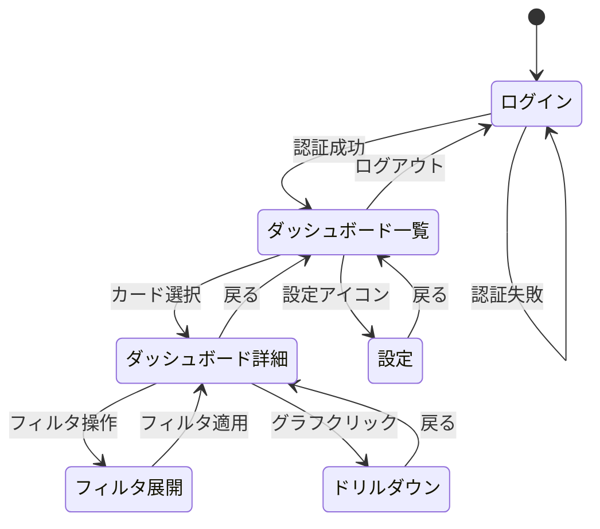

# 全画面一覧

## 画面一覧テーブル

| 画面ID | 画面名 | URL | ワイヤーフレーム | 使用コンポーネント |
|--------|--------|-----|----------------|------------------|
| SCR-001 | ログイン | /login | wireframes/01_login.png | LoginForm, Button |
| SCR-002 | ダッシュボード一覧 | /dashboard | wireframes/02_dashboard-list.png | DashboardCard, SearchBar |
| SCR-003 | ダッシュボード詳細 | /dashboard/:id | wireframes/03_dashboard-detail.png | KpiCard, ChartContainer, FilterBar, DataTable |
| SCR-004 | 設定 | /settings | wireframes/04_settings.png | UserTable, RoleSelect |
| [TODO] | [TODO] | [TODO] | [TODO] | [TODO] |

## 画面遷移図

## 各画面の状態一覧

| 画面ID | 状態 | ワイヤーフレーム | 説明 |
|--------|------|----------------|------|
| SCR-003 | 通常表示 | 03_dashboard-detail.png | データ正常表示 |
| SCR-003 | ローディング | 03_dashboard-detail-loading.png | スケルトン表示 |
| SCR-003 | データ0件 | 03_dashboard-detail-nodata.png | 空状態メッセージ |
| SCR-003 | エラー | 03_dashboard-detail-error.png | エラーメッセージ + リトライ |
| SCR-003 | フィルタ展開 | 03_dashboard-detail-filter-open.png | フィルタパネル表示 |
| [TODO] | [TODO] | [TODO] | [TODO] |
