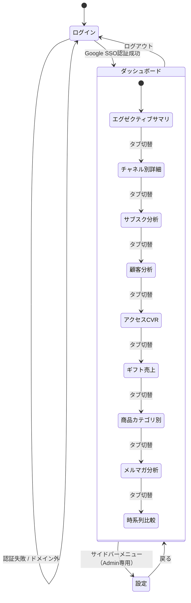

# 全画面一覧

## 画面一覧テーブル

| 画面ID | 画面名 | URL | ワイヤーフレーム | 使用コンポーネント |
|--------|--------|-----|----------------|------------------|
| SCR-001 | ログイン | /login | wireframes/01_login.png | LoginForm, Button |
| SCR-002 | ダッシュボード | /dashboard | wireframes/02-10_dashboard-*.png | TabNavigation, FilterBar, KpiCard, EChartWrapper, DataTable, CohortHeatmap, GiftProgressGauge |
| SCR-003 | ユーザー管理 | /settings/users | wireframes/11_settings.png | UserTable, InviteModal, RoleSelector, UserDetailPanel |
| SCR-004 | システム設定 | /settings/system | wireframes/11_settings.png | EventCalendar, TargetEditor, GiftSeasonEditor, SlackSettings |

## 画面遷移図

## 各画面の状態一覧

| 画面ID | 状態 | ワイヤーフレーム | 説明 |
|--------|------|----------------|------|
| SCR-001 | 初期表示 | 01_login.png | Google SSOボタン表示 |
| SCR-001 | ローディング | 01_login-loading.png | ボタン内スピナー + disabled |
| SCR-001 | 認証失敗 | 01_login-error.png | 赤色エラーバナー |
| SCR-002 | 通常表示 | 02_dashboard-executive.png | データ正常表示 |
| SCR-002 | ローディング | 02_dashboard-loading.png | スケルトン表示 |
| SCR-002 | データ0件 | 02_dashboard-nodata.png | 空状態メッセージ（「該当する期間のデータがありません」） |
| SCR-002 | エラー | 02_dashboard-error.png | エラーメッセージ + リトライボタン |
| SCR-002 | フィルタ変更中 | - | 対象グラフ/テーブルのみスピナー、他は維持 |
| SCR-003 | 通常表示 | 11_settings-users.png | ユーザー一覧テーブル |
| SCR-003 | 招待モーダル | 11_settings-invite.png | 招待フォーム表示 |
| SCR-003 | ユーザー詳細 | 11_settings-detail.png | スライドパネル表示 |
