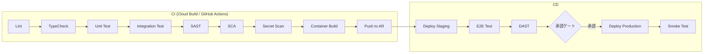

# CI/CD パイプライン設計

## パイプライン図

## CI（Cloud Build / GitHub Actions）

| ステップ | コマンド | 失敗時 |
|---------|---------|--------|
| Lint | `npm run lint` | ブロック |
| TypeCheck | `npm run typecheck` | ブロック |
| Unit Test | `npm run test` | ブロック |
| Integration Test | `npm run test -- --integration` | ブロック |
| SAST | `semgrep scan --config=auto` | Critical/High → ブロック |
| SCA | `trivy fs --severity HIGH,CRITICAL .` | Critical/High → ブロック |
| Secret Scan | `gitleaks detect` | 検出 → ブロック |
| Container Build | `docker build -t app .` | ブロック |
| Push | Artifact Registryへpush | - |

## CD

| 環境 | トリガー | 承認 |
|------|---------|------|
| Staging | `staging`ブランチへのマージ | 自動 |
| Production | `main`ブランチへのマージ | [TODO: 手動承認 / 自動] |

## Terraform CI

| イベント | アクション |
|---------|----------|
| PR作成時 | `terraform plan` → 差分をPRコメントに表示 |
| mainマージ時 | `terraform apply` → **人間の承認必須** |

## 品質ゲート（Gate 0〜5）

詳細は `docs/06_lifecycle/quality-gates.md` を参照。

| ゲート | フェーズ | 自動/手動 |
|--------|----------|----------|
| Gate 0 | 要件定義完了 | 手動（PO承認） |
| Gate 1 | 設計完了 | 手動（TL承認） |
| Gate 2 | 実装完了 | CI自動 + 手動レビュー |
| Gate 3 | テスト完了 | CI自動 + QA確認 |
| Gate 4 | リリース判定 | 手動（全ステークホルダー） |
| Gate 5 | リリース後評価 | 手動（振り返り） |
